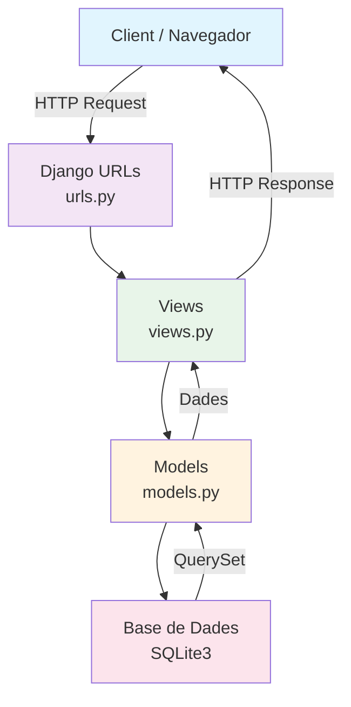
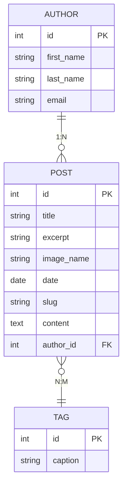

# My Site - Projecte Blog amb Django

<p align="center">
  Aplicació web desenvolupada amb Django per gestionar publicacions, autors i etiquetes.
</p>

<p align="center">


</p>

---

# Descripció del Projecte

Aquest projecte consisteix en una aplicació web desenvolupada amb Django que permet gestionar un sistema de blog complet amb publicacions, autors i etiquetes.

El projecte utilitza:

- Django Framework
- SQLite3
- Templates HTML
- Sistema de rutes Django
- Django ORM
- GitHub Actions
- Pydoc

---

# Característiques Principals

- Sistema de publicacions
- Visualització detallada de posts
- Gestió d'autors
- Sistema d'etiquetes
- Templates dinàmics
- Panell d'administració Django
- Arquitectura MVC
- ORM amb Django Models
- Documentació automàtica amb Pydoc
- Integració contínua amb GitHub Actions

---

# Arquitectura de l'Aplicació


---

# Diagrama de Base de Dades



---

# Tecnologies Utilitzades

| Tecnologia | Descripció |
|---|---|
| Python 3.12 | Llenguatge principal |
| Django 6 | Framework web |
| SQLite3 | Base de dades |
| HTML5 | Estructura frontend |
| CSS3 | Estils |
| GitHub Actions | CI/CD |
| Pydoc | Documentació automàtica |

---

# Estructura del Projecte

```text
my_site/
│
├── blog/
│   ├── migrations/
│   ├── templates/
│   ├── static/
│   ├── admin.py
│   ├── apps.py
│   ├── models.py
│   ├── urls.py
│   └── views.py
│
├── my_site/
│   ├── settings.py
│   ├── urls.py
│   ├── asgi.py
│   └── wsgi.py
│
├── docs/
│
├── .github/
│   └── workflows/
│       └── pydoc.yml
│
├── manage.py
├── db.sqlite3
├── requirements.txt
└── README.md
```

---

# Instal·lació

## Clonar Repositori

```bash
git clone https://github.com/USUARI/my_site.git

cd my_site
```

---

## Crear Entorn Virtual

### Linux

```bash
python3 -m venv venv

source venv/bin/activate
```

### Windows

```powershell
python -m venv venv

venv\Scripts\activate
```

---

## Instal·lar Dependències

```bash
pip install -r requirements.txt
```

---

# Configuració de la Base de Dades

## Executar Migracions

```bash
python manage.py migrate
```

---

## Crear Superusuari

```bash
python manage.py createsuperuser
```

---

# Executar el Projecte

## Iniciar Servidor Django

```bash
python manage.py runserver
```

---

## Accedir a l'Aplicació

```text
http://127.0.0.1:8000/
```

---

# Rutes Principals

| Ruta | Descripció |
|---|---|
| `/` | Pàgina principal |
| `/posts` | Totes les publicacions |
| `/authors` | Llista d'autors |
| `/tags` | Llista d'etiquetes |
| `/admin` | Panell administració Django |

---

# Documentació Pydoc

Aquest projecte genera documentació HTML automàtica utilitzant Pydoc.

## Generar Documentació Manualment

```bash
pydoc -w blog.views
pydoc -w blog.models
pydoc -w blog.urls
```

---

# GitHub Actions

El projecte incorpora GitHub Actions per automatitzar:

- Instal·lació de dependències
- Generació de documentació
- Publicació amb GitHub Pages
- Integració contínua

---

# GitHub Pages

La documentació generada es publica automàticament a:

```text
https://USUARI.github.io/my_site/
```

---

# Captures de Pantalla

## Pàgina Principal


---

## Pàgina de Publicacions


---

## Detall de Publicació


---

## Panell d'Administració Django


---

# Llicència

MIT License

---

# Autor

Copyright (c) 2025-2026 Toni Canal
